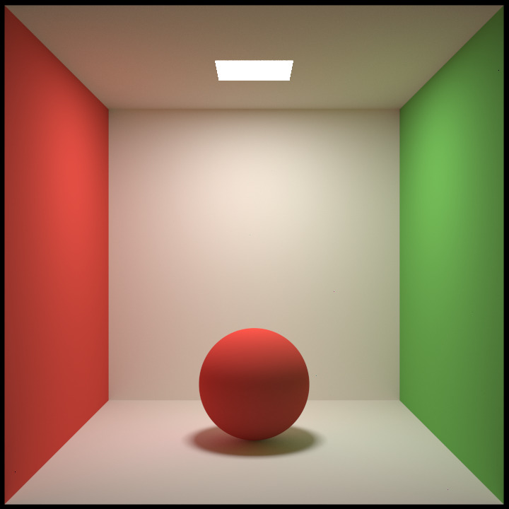

<h1 align="center">Just Tracer</h1>

软光线追踪渲染器 720p×720p | 5000spp 渲染结果

## About 

**Just Tracer** 是我学习图形学的过程中用于练习的软光线追踪渲染器，其中很多设计和算法参考了许多的开源软渲染器和知乎等网站上的文章。感谢这些优秀且无私的作者，为像我一样初窥图形学门径的新人提供了指路明灯。

## Reference

> 1. [Ray Tracing in One Weekend Series](https://raytracing.github.io/)
> 2. [smallpt - 99 行 C++ 代码实现全局光照](http://www.kevinbeason.com/smallpt/)
> 3. [smallpt魔改版 - vinjn 提供的合集](https://github.com/vinjn/learn-raytracing)
> 4. [smallpt改写为pbrt - infancy 的超长解析文章](https://infancy.github.io/smallpt2pbrt.html)
> 5. [Pursuit - ksgfk 的软光追渲染器](https://github.com/ksgfk/Pursuit)
> 6. [Nori - ksgfk 的作业解析](https://www.zhihu.com/column/c_1407025850030698496)
> 7. [TinyRenderer - 有些修改的中文教程](https://zhuanlan.zhihu.com/p/399056546)
> 8. [Filament - PBR 文档的中文翻译](https://jerkwin.github.io/filamentcn/Filament.md.html)
> 9. [GAME101 - liupeining 的作业7实现](https://github.com/liupeining/Games_101_homework/tree/main/a7)
> 10. [RenderHelp - 矢量模板类的设计值得学习](https://github.com/skywind3000/RenderHelp)
> 11. [Mitsuba1/2 闫令琦推荐的科研渲染器](http://www.mitsuba-cornellBoxRenderer.org/) 
> 12. [pbrt - 众所周知的圣经](https://www.pbr-book.org/3ed-2018/contents)

## TODO
- 对光源采样
  - 多光源均匀采样（PS: 所有光源视为整体的积分域）
- 微表面模型
  - 镜面反射特殊处理 （PS: isDelta 标识）
  - 镜面反射能量补偿 （PS: Kulla-Conty 方法）
- 重要性采样
  - 漫反射和镜面反射BRDF处理 
  - 混合BRDF

## Feature

- [x] Intersect 物体
    - [x] Sphere 球体
    - [x] Triangle 三角形
    - [x] Rectangle 矩形
- [ ] Model 模型
  - [ ] Mesh 网格
  - [ ] Texture 纹理
- [x] Ray 射线
- [x] HitResult 相交结果
- [x] Renderer 渲染器
  - [x] OpenMP多线程加速
- [x] Film 胶片
- [x] Scene 场景
- [x] Camera 相机
- [x] Sampler 采样器
  - [x] Trapezoidal 梯形分布
  - [x] Uniform 均匀分布
- [x] Integrator 积分器
  - [x] MonteCarloPathIntegrator 蒙特卡洛路径追踪
- [x] BxDF 双向X分布函数
  - [x] IdealDiffuseBxDF 漫反射分布函数
  - [x] IdealSpecularBxDF 理想镜面反射分布函数
  - [x] SpecularBxDF 镜面（光泽）反射分布函数
- [x] Material 材质
  - [ ] LambertMaterial 漫反射材质
  - [ ] MirrorMaterial 镜面材质
  - [ ] MetalMaterial 金属材质
  - [ ] MircofacetMaterial 微表面
- [x] Light 灯光：作为抽象类由继承该类的 Object 实现
- [ ] Accelerator 加速结构
  - [x] AABB 轴向包围盒
  - [ ] BVH 层次包围体
- [ ] Tool 工具 
  - [x] Vector 矢量模板类
  - [ ] Matrix 矩阵模板类
  - [ ] Math 数学工具类
  - [x] Global 全局定义类
  - [x] Random 随机数类
- [ ] Loader 文件加载与解析 
  - [x] ObjLoader 模型obj文件解析 
  - [ ] JsonLoader 场景json文件解析

##  

以后可能会加上 stb_image 头文件以支持输出其他格式图片
